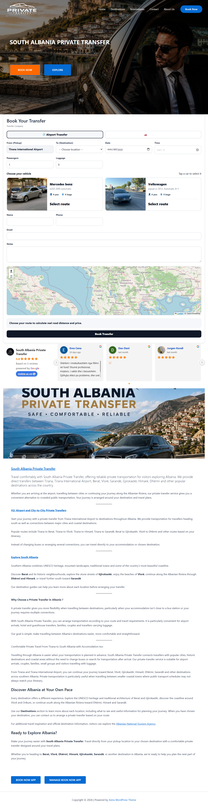
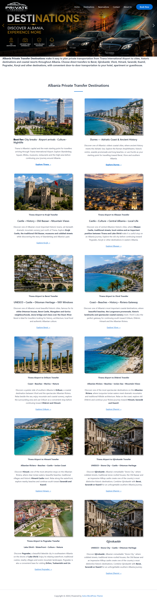
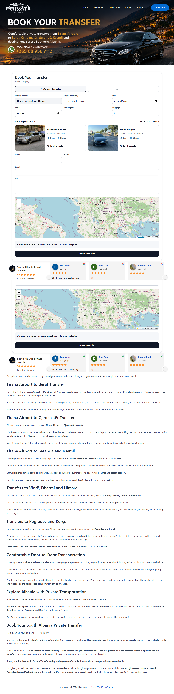

# south-albania-transfer-proof
Live WordPress site for a private transfer business in Albania — booking flow, destinations, SEO pages.
# South Albania Private Transfer

Live WordPress business site for a private transfer company operating across southern Albania.

**Live URL:** https://trprivate-al.com

---

## Screenshots

### Homepage

### Destinations Page

### Booking Form

---

## My Role

I built and maintain the entire site. It serves real customers booking real transfers between Tirana International Airport and destinations across southern Albania.

---

## What I Built

### Homepage
- Hero section with brand identity and dual CTAs (Book Now / Explore)
- Clear navigation to Destinations, Reservations, Contact, About Us
- Mobile-responsive layout

### Destinations Page
- SEO-optimized landing structure targeting specific routes:
  Tirana → Berat, Gjirokastër, Vlorë, Himarë, Sarandë, Ksamil, Pogradec, Korçë
- Each route targets real search queries travelers use when planning Albania trips
- Feature highlights: Top Destinations, Unforgettable Experiences, Safe & Reliable Transfers, 24/7 Support

### Booking Flow
Multi-step reservation form including:
- Pickup location (Tirana International Airport)
- Destination dropdown with all served cities
- Date and time selection
- Passenger and luggage counters
- Vehicle selection with real capacity display:
  - Mercedes Benz w203 2005 (automatic) — 4 pax / 4 bags
  - Volkswagen Passat CC 2012 (automatic, 4+1) — 4 pax / 4 bags
- Customer contact fields (name, phone, email, notes)

### Reviews Section
- Customer testimonials displayed on-site (multi-language: Albanian/English)
- Real reviews from actual customers

---

## Tech Stack

- **WordPress** — CMS foundation
- **Astra** — WordPress theme
- **Booking plugin** — reservation system
- **PHP** — for any custom functionality
- **MySQL** — database
- **HTML / CSS / JavaScript** — frontend

---

## What Broke and How I Fixed It

When I first configured the booking form, reservations weren't saving the destination field
correctly. I traced the issue to how the pickup and destination fields were connected in the
booking plugin settings. After testing different configurations and rebuilding the route list,
bookings started saving with the correct pickup, destination, and vehicle.

---

## What I'd Improve Next

- Image compression for faster page load
- Mobile menu refinements
- [Add your own observations]

---

## Contact

Built and maintained by Vilson Xhanari
GitHub: https://github.com/vilsonxhanari
